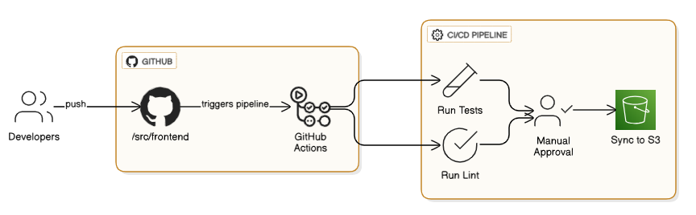
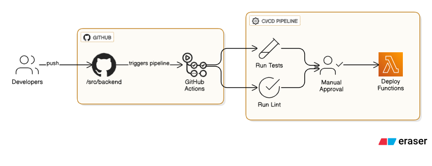

# Serverless Todo App - DevOps AWS Project

[](https://github.com/HasanAshab/serverless-todo-app/actions/workflows/frontend-cicd.yaml)
[](https://github.com/HasanAshab/serverless-todo-app/actions/workflows/backend-cicd.yaml)
[](https://github.com/HasanAshab/serverless-todo-app/actions/workflows/terraform-cicd.yaml)
[](https://github.com/HasanAshab/serverless-todo-app/actions/workflows/terraform-drift.yaml)

A comprehensive DevOps implementation showcasing modern serverless architecture, automated CI/CD pipelines, and Infrastructure as Code (IaC) practices for a simple todo application on AWS.

## 🎯 Project Overview


This project demonstrates enterprise-grade DevOps practices by implementing a complete serverless cloud infrastructure and deployment pipeline for a todo application. The focus is on **DevOps engineering excellence**, featuring automated infrastructure provisioning, continuous integration/deployment, and production-ready serverless architecture.

### 🏆 Key Achievements

- **100% Serverless Architecture** - Complete AWS serverless stack with Lambda, API Gateway, and DynamoDB
- **Infrastructure as Code** - Complete AWS infrastructure managed through Terraform
- **Automated CI/CD Pipelines** - Zero-touch deployments with GitHub Actions
- **Multi-Environment Support** - Separate dev/staging/production environments
- **Cost-Effective Scaling** - Pay-per-request serverless model with automatic scaling
- **Security & Compliance** - AWS best practices with IAM roles and least privilege access

## 🏗️ Architecture


### Serverless Architecture Components

#### 🎨 **Frontend Tier**
- **Technology**: React SPA with modern JavaScript
- **Hosting**: Amazon S3 static website hosting
- **CDN**: CloudFront for global content delivery with caching optimization
- **Security**: Origin Access Control (OAC) for secure S3 access
- **Performance**: Optimized cache behaviors for static assets

#### ⚙️ **Backend Tier (Serverless)**
- **API Gateway**: HTTP API for RESTful endpoints with CORS support
- **Lambda Functions**: Individual functions for each CRUD operation
  - `GET /todos` - List all todos
  - `POST /todos` - Create new todo
  - `GET /todos/{id}` - Get specific todo
  - `PUT /todos/{id}` - Update todo
  - `DELETE /todos/{id}` - Delete todo
- **Runtime**: Node.js with ES modules (.mjs)
- **Auto Scaling**: Automatic scaling based on request volume
- **Security**: IAM roles with least privilege access to DynamoDB

#### 🗄️ **Data Tier (NoSQL)**
- **Database**: Amazon DynamoDB with pay-per-request billing
- **Schema**: Simple key-value store with `id` as hash key
- **Performance**: Single-digit millisecond latency
- **Scaling**: Automatic scaling with no capacity planning
- **Security**: IAM-based access control from Lambda functions

## 🚀 DevOps Features

### Infrastructure as Code
```
infra/
├── modules/           # Reusable Terraform modules
│   ├── frontend/     # S3, CloudFront with OAC
│   └── backend/      # Lambda functions, API Gateway, IAM roles
├── envs/            # Environment-specific configurations
│   ├── dev.tfvars   # Development environment settings
│   └── prod.tfvars  # Production environment settings
├── tests/           # Infrastructure testing
└── main.tf          # Main infrastructure orchestration
```

### CI/CD Pipeline
* **Frontend**:

Automated deployment pipeline that uploads build artifacts to S3 (requires manual approval) on successful push to the main branch from `/src/frontend`. The React application is built, optimized, and deployed to S3, then distributed globally via CloudFront CDN. Requires manual approval for production deployment.

* **Backend**:

Automated deployment pipeline that packages and deploys Lambda functions via Terraform (requires manual approval) on every successful push to the main branch from `/src/backend`. Uses rolling updates with Lambda versioning and automatic rollback capabilities.

### Key DevOps Practices

✅ **Infrastructure as Code** - 100% Terraform-managed infrastructure
✅ **GitOps Workflow** - Git-based infrastructure and deployment management
✅ **Multi-Environment** - Separate dev/staging/production environments
✅ **Security First** - SSL/TLS, security groups, least privilege access
✅ **Monitoring & Logging** - CloudWatch integration and alerting
✅ **Cost Optimization** - Serverless pay-per-request model, efficient resource usage
✅ **High Availability** - Serverless architecture with automatic failover

## 🛠️ Technology Stack

### DevOps & Infrastructure
| Component | Technology |
|-----------|------------|
| **Cloud Platform** | AWS |
| **Infrastructure as Code** | Terraform |
| **CI/CD** | GitHub Actions |
| **Serverless Compute** | AWS Lambda |
| **API Management** | API Gateway (HTTP API) |
| **Monitoring** | CloudWatch |
| **Security** | AWS IAM, Lambda execution roles |
| **CDN** | CloudFront with Origin Access Control |

### Application Stack
| Tier | Technology |
|------|------------|
| **Frontend** | Next.js, React, JavaScript |
| **Backend** | Node.js, AWS Lambda (ES Modules) |
| **Database** | Amazon DynamoDB |
| **Development** | Local development environment |

## 📁 Project Structure

```
├── .github/
│   ├── actions/              # Reusable GitHub Actions
│   └── workflows/            # CI/CD pipeline definitions
│       ├── frontend-cicd.yaml    # Frontend build & deploy
│       ├── backend-cicd.yaml     # Backend build & deploy
│       ├── terraform-cicd.yaml   # Infrastructure deployment
│       └── terraform-drift.yaml  # Infrastructure drift detection
├── infra/                    # Infrastructure as Code
│   ├── modules/              # Reusable Terraform modules
│   │   ├── frontend/         # S3, CloudFront with OAC
│   │   └── backend/          # Lambda, API Gateway, IAM
│   ├── envs/                 # Environment-specific configs
│   │   ├── dev.tfvars        # Development environment
│   │   └── prod.tfvars       # Production environment
│   ├── tests/                # Infrastructure testing
│   ├── main.tf               # Main infrastructure orchestration
│   ├── variables.tf          # Input variables
│   ├── outputs.tf            # Output values
│   └── locals.tf             # Local values and computed data
├── src/                      # Application source code
│   ├── frontend/             # React application
│   └── backend/              # Lambda functions (Node.js)
└── static/                   # Documentation assets
```

## 🚀 Quick Start

### Prerequisites

- AWS CLI configured with appropriate permissions
- Terraform >= 1.10.0
- Docker and Docker Compose
- Node.js 18+ and npm
- Java 17+ and Maven

### Local Development

```bash
# Clone the repository
git clone https://github.com/HasanAshab/serverless-todo-app.git
cd serverless-todo-app

# Install frontend dependencies
cd src/frontend
npm install
npm start

# The frontend will be available at http://localhost:3000
# For backend testing, deploy to AWS or use local Lambda simulation
```

### Infrastructure Deployment

```bash
# Navigate to infrastructure directory
cd infra

# Initialize Terraform
terraform init

# Create and select workspace
terraform workspace new dev
terraform workspace select dev

# Plan and apply infrastructure
terraform plan -var-file=./envs/dev.tfvars
terraform apply -var-file=./envs/dev.tfvars

# Get outputs (API Gateway URL, CloudFront URL)
terraform output
```

## 🔧 Configuration

### Environment Configuration

Key configuration options in `envs/dev.tfvars`:

```hcl
# Environment Configuration
environment = "dev"
aws_region = "us-west-2"

# DynamoDB Configuration
db_billing_mode = "PAY_PER_REQUEST"

# CloudFront Configuration
frontend_cdn_price_class = "PriceClass_100"

# Security Configuration
enable_deletion_protection = false
```

### Environment-Specific Configuration

- **Development** (`envs/dev.tfvars`): Pay-per-request billing, basic CDN
- **Production** (`envs/prod.tfvars`): Optimized settings, deletion protection enabled

## 📊 Monitoring & Observability

### CloudWatch Integration
- **Lambda Metrics**: Function duration, error rates, invocation counts
- **API Gateway Metrics**: Request latency, error rates, throttling
- **DynamoDB Metrics**: Read/write capacity, throttling events
- **Custom Dashboards**: Serverless application overview
- **Alerting**: CloudWatch alarms for error thresholds

### Drift Detection
- **Automated Scanning**: Daily infrastructure drift detection
- **Compliance Monitoring**: AWS Config rules validation
- **State Verification**: Terraform state consistency checks

## 🔒 Security Features

### Infrastructure Security
- **IAM Roles**: Least privilege access for Lambda execution
- **API Security**: API Gateway with built-in throttling and monitoring
- **Data Encryption**: DynamoDB encryption at rest
- **Access Control**: Function-level permissions for DynamoDB operations

### Application Security
- **HTTPS Enforcement**: CloudFront SSL termination
- **Origin Security**: Origin Access Control (OAC) for S3 protection
- **Function Security**: Lambda execution roles with minimal permissions
- **CORS Configuration**: Proper cross-origin resource sharing setup

## 🌟 Key Features

✅ **Infrastructure as Code** - 100% Terraform-managed AWS infrastructure
✅ **GitOps Workflow** - Git-based infrastructure and deployment management
✅ **Multi-Environment** - Separate dev/staging/production environments
✅ **Serverless Scaling** - Automatic scaling with zero server management
✅ **Pay-per-Use** - Cost-effective serverless billing model
✅ **High Availability** - Built-in redundancy across AWS regions
✅ **Security First** - IAM-based access control and encryption
✅ **Monitoring & Alerting** - CloudWatch integration for serverless metrics
✅ **Fast Deployments** - Lambda versioning with instant rollbacks

## 🤝 Contributing

Contributions are welcome! Please focus on:

- Infrastructure improvements and optimizations
- CI/CD pipeline enhancements
- Security and compliance features
- Documentation and best practices
- Performance optimizations

### Development Workflow

1. Fork the repository
2. Create a feature branch
3. Make your changes
4. Test locally with Docker Compose
5. Submit a pull request

## 📈 Performance & Scalability

### Serverless Scaling
- **Lambda Concurrency**: Automatic scaling up to 1000 concurrent executions
- **DynamoDB**: On-demand scaling with pay-per-request billing
- **CloudFront**: Global edge locations for low latency content delivery

### Cost Optimization
- **Serverless Model**: Pay only for actual usage (requests, compute time, storage)
- **Resource Tagging**: Detailed cost allocation across environments
- **Efficient Architecture**: No idle server costs, automatic resource optimization

## 🔄 Deployment Strategies

### Serverless Deployment
- **Lambda Versioning**: Atomic deployments with instant rollbacks
- **API Gateway Stages**: Environment-specific API endpoints
- **CloudFront Invalidation**: Cache invalidation for frontend updates

### Infrastructure Updates
- **Terraform Planning**: Review changes before application
- **State Locking**: Prevent concurrent modifications
- **Backup Strategy**: State file versioning and backup

## 📚 Documentation

- [Infrastructure Documentation](infra/README.md) - Detailed infrastructure setup
- [Architecture Decisions](docs/architecture.md) - Design rationale and trade-offs
- [Deployment Guide](docs/deployment.md) - Step-by-step deployment instructions
- [Troubleshooting](docs/troubleshooting.md) - Common issues and solutions

## 🏷️ License

This project is licensed under the MIT License - see the [LICENSE](LICENSE) file for details.

## 🙏 Acknowledgments

- AWS Community for excellent documentation and best practices
- Terraform community for infrastructure patterns
- Open source community for application frameworks

## 📞 Contact

For questions about the DevOps implementation, infrastructure design, or deployment processes:

- **GitHub Issues**: [Create an issue](https://github.com/HasanAshab/serverless-todo-app/issues)
- **LinkedIn**: [Connect with me](https://linkedin.com/in/hasan-ashab)

---

**Note**: This project demonstrates comprehensive DevOps engineering capabilities including Infrastructure as Code, CI/CD pipeline design, serverless architecture, security implementation, and automation. The serverless todo application serves as a practical example to showcase these DevOps practices in a real-world, production-ready scenario.
