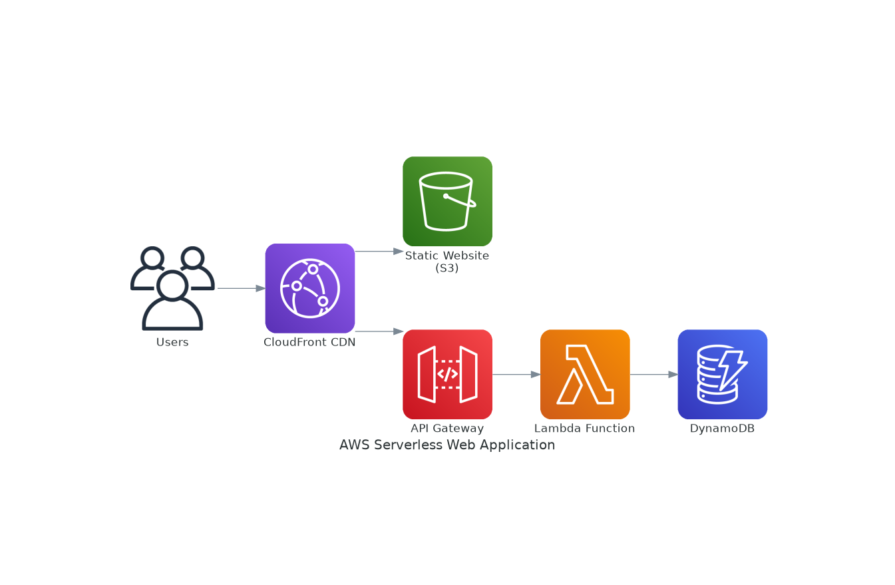
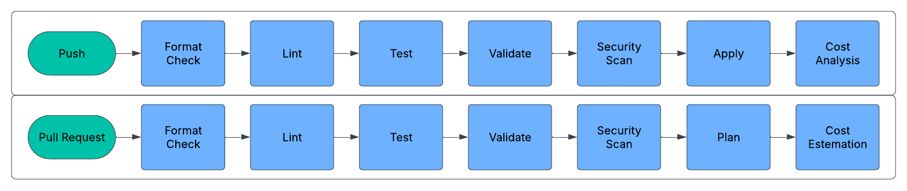

# Three Tier Architecture AWS


[](https://github.com/HasanAshab/three-tier-aws/actions/workflows/terraform-cicd.yaml)
[](https://github.com/HasanAshab/three-tier-aws-infra/actions/workflows/terraform-drift.yaml)

This folder contains the infrastructure (IaC) for [Spring + React App](https://github.com/HasanAshab/three-tier-aws/) project.


## 🏗️ Architecture Diagram



## Infrastructure Components

- **Frontend Tier**: React SPA served via CloudFront CDN + S3
- **Backend Tier**: Spring Boot API on ECS Fargate with Application Load Balancer
- **Data Tier**: MySQL RDS with automated backups and scaling
- **Networking**: VPC with public/private subnets across multiple AZs
- **Security**: SSL/TLS encryption, security groups, and IAM roles
- **DNS**: Route 53 hosted zone with custom domain management

## ⚙️ CI/CD Pipeline


---


## 🚀 How to Apply

Follow these steps to deploy the infrastructure using Terraform:

### 1. Copy Environment Configuration

```bash
cp .env.sample .env
```

Edit `.env` and override necessary variables according to your environment (e.g., AWS credentials, database credentials).

### 2. Load Environment Variables

```bash
source ./bin/load_env.sh
```

This script will export all environment variables defined in `.env` for the current shell session.

### 3. Select Terraform Workspace

Choose the workspace you want to deploy (e.g., `dev` or `prod`):

```bash
terraform workspace select dev
```

If the workspace doesn't exist yet, create it:

```bash
terraform workspace new dev
```

### 4. Apply Terraform Configuration

Run Terraform apply with the corresponding tfvars file:

```bash
terraform apply -var-file=./envs/dev.tfvars
```

For production:

```bash
terraform apply -var-file=./envs/prod.tfvars
```
---
